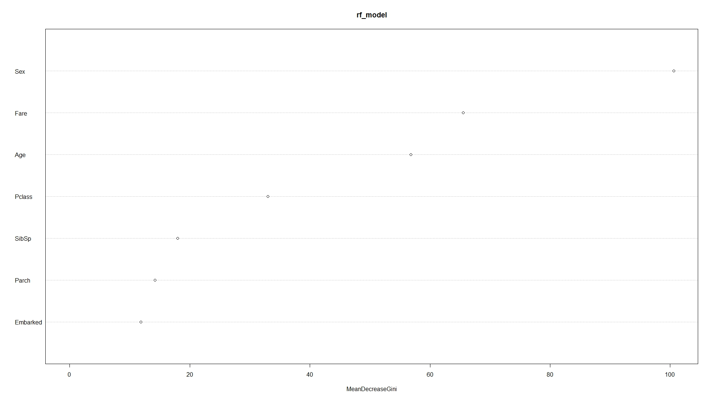
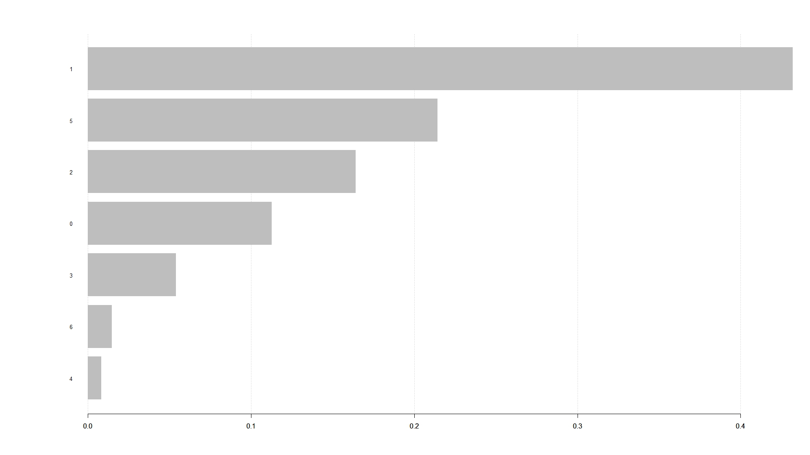
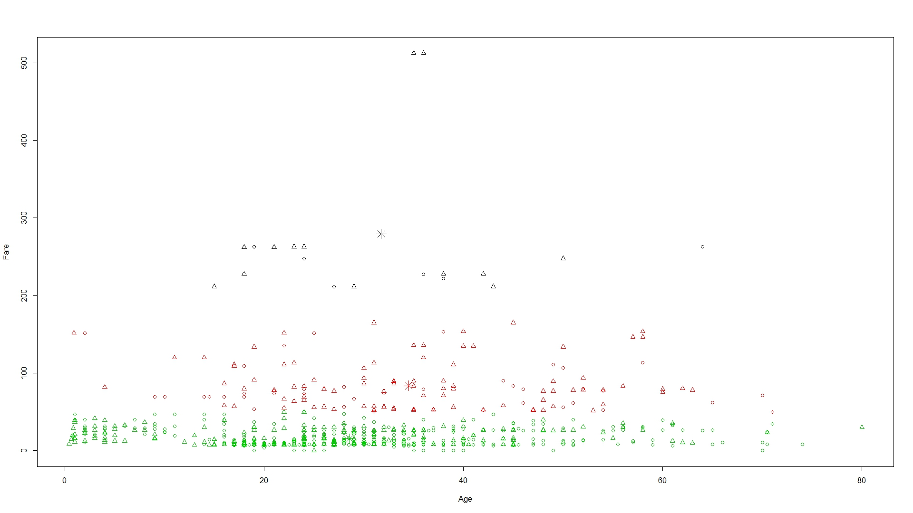
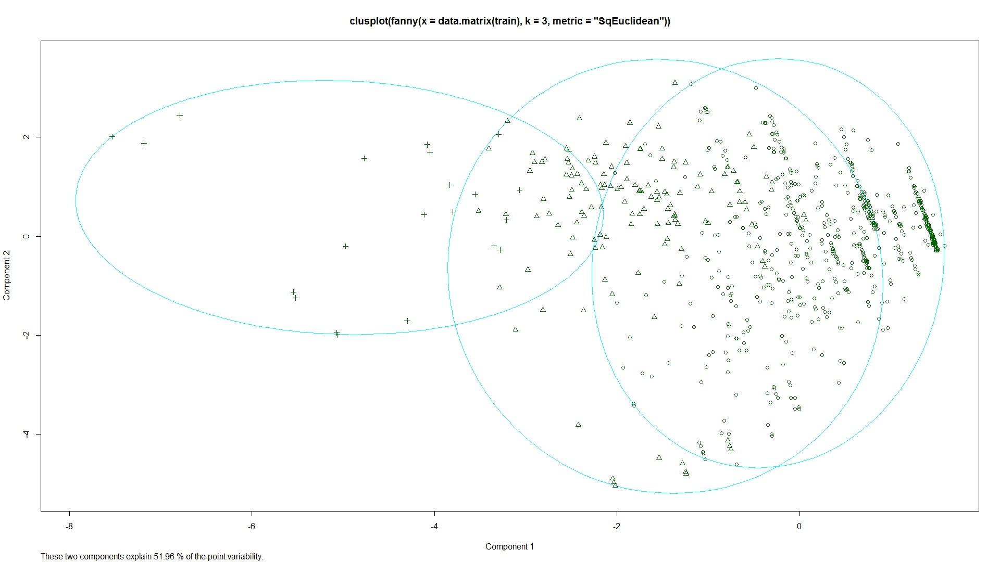

# 作业2

姓名：葛传斌    学号：2120171404

## 数据处理

- 分类和聚类的分析选用了titanic数据集；

- 首先对数据进行统计分析，确定属性变量类型，观察数据的缺失情况；

- 接着对Embarked中的两个缺失值用众数填充，对Fare中的一个缺失值用中位数填充，对年龄缺失值较多的情况进行了独立处理，完成数据缺失值的处理。

- 完成了缺失值的处理后，采用了两种分类方法，两种聚类方法，将数据转换为相应的格式，完成了分类和聚类的分析。

## 分类结果与分析

>采用了两种算法进行，随机森林算法和Xgboost算法。

 1、随机森林算法

>用随机森林模型进行训练，得到训练集的分类情况如下，正确率、灵敏度、特异度分别为**91.69%，95.30%，90.19%**。

            target_rf
    pred_train_rf   0   1
                0 533  58
                1  16 284

>分类的错误率如下图所示，

>变量的重要性如下图所示，

对应的属性按重要性排序依次为，
    
    'Sex','Fare','Age','Pclass','SibSp','Parch','Embarked'

将测试集数据得到的预测值提交到kaggle网站上，得到的评分为**0.76555**，结合训练集的结果来看，存在一定的过拟合问题。

 2、Xgboost算法

>Xgboost模型的训练参数如下，因为属性数量较少，树的最大深度 _max\_depth_ 减小到5.

    xgb_model <- xgboost(data = train_data,label = target,
                     eta=0.1,max_depth = 5,nrounds = 100)

>训练集的分类情况如下，正确率、灵敏度、特异度分别为**94.16%，95.31%，93.52%**。

            target
    pred_train   0   1
            0  534  37
            1   15 305

>变量的重要性如下图所示，

对应的属性按重要性排序依次为，
    
    'Sex','Fare','Age','Pclass','SibSp','Embarked','Parch'

各个属性的重要性排序与随机森林得到的结果基本是一致的。
将测试集数据得到的预测值提交到kaggle网站上，得到的评分为**0.7751**，略高与随机森林得到的结果，同时结合训练集的结果来看，同样存在一定的过拟合问题。

## 聚类结果与分析

### K-means算法聚类结果与分析

>采用了两种方法进行，K-means算法和Funny Analysis Cluster算法。

>target为存活情况，各个聚类类别的存活情况表如下所示，

            cluster  
    target        1   2   3
        0         6  46 497
        1        14  95 233

>以age和fare的关系作图，聚类结果图如下，结合上表可以看到，聚类类别1，2，3分别为黑色、红色、绿色所代表，在3个类别中不同年段的存活情况没有太大差别，fare较低的人群的存活率要率低于fare较高的人群。

### Funny Analysis Cluster算法挖掘结果与分析

>target为存活情况，各个聚类类别的存活情况如下所示，

            cluster
    target      1   2   3
        0     490  53   6
        1     231  95  16

>聚类情况图如下所示，可以看到几个类别并没有完全区分开，右侧两个类别的数据交叉部分较多，但几个类别还是存活情况还是表现出了一定的差异，结合聚类的结果，回到数据集查看对应的属性情况，我们得到了和上面运用K-means方法一样的结论，fare值较低的人群的存活率要率低于fare较高的人群。

## 文件说明

1、 classification.R：数据的预处理、两种分类模型及其结果的可视化；
2、 cluster.R：两种聚类方法及其结果的可视化；
3、 error_rate.jpeg：随机森林分裂错误率图；
4、 rf_importance.jpeg：随机森林变量重要性排序图； 
5、 xgb_importance.jpeg：随机森林变量重要性排序图；
6、 k-means_cluster.jped：K-means方法的聚类结果图；
7、 fanny_cluster.jped：K-means方法的聚类结果图；

 